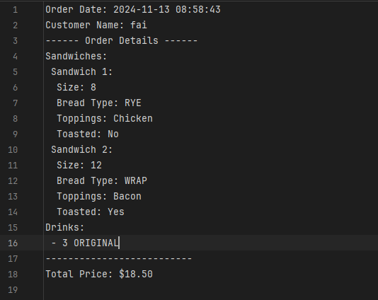
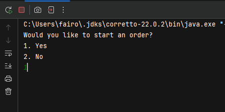
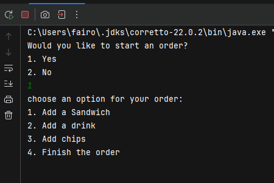
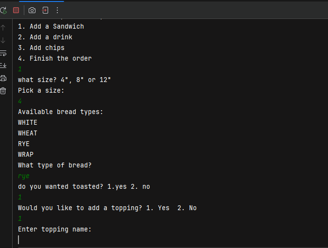
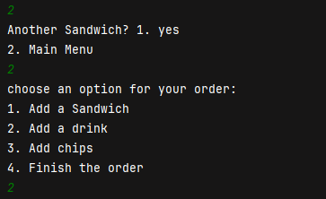
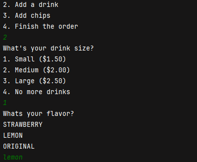
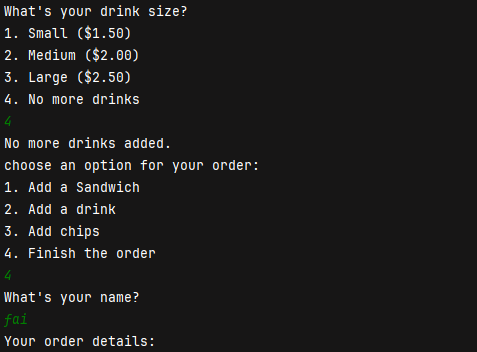
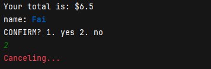
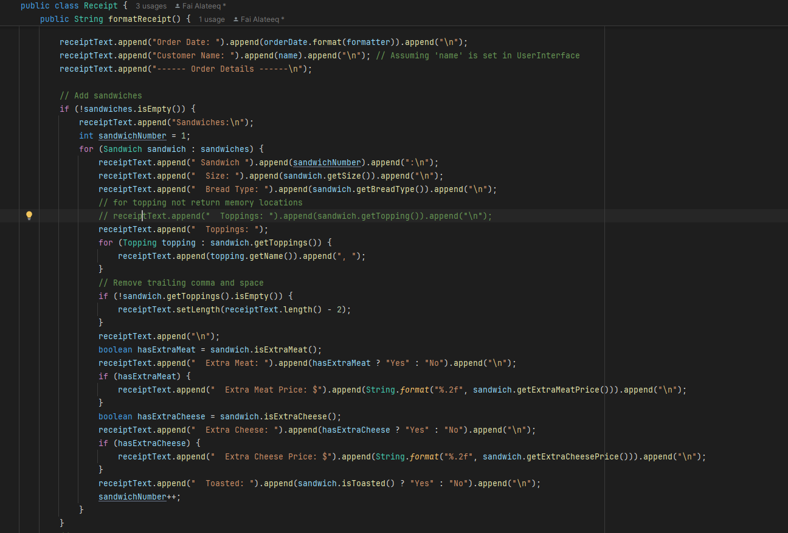
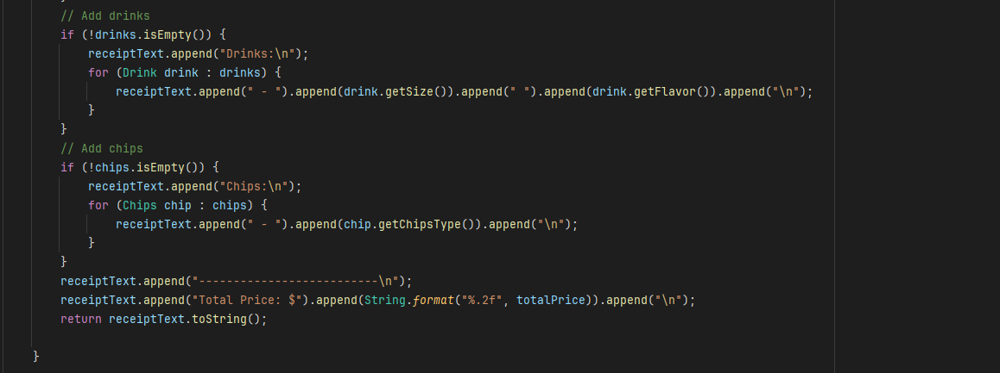

# 🥪 Deli Order Management System 🥤

## Description: 

The Deli Order Management System is a Java-based console application that simulates a deli ordering experience. This system allows users to customize and place sandwich orders with various options for bread, toppings, drinks, and chips. Designed to be user-friendly, it offers an intuitive ordering process with the ability to view order summaries and save each order as a receipt file.

### Main Classes:

- Order class: View a detailed summary of the order, including total price, and confirm the order at checkout.
- Sandwich class: For sandwich customization.
- Topping abstract class
- PremiumTopping and RegularTopping child classes:  Select from a list of vegetables, meats, and cheeses, with additional charges for premium toppings like extra meat or extra cheese based on sandwich size.
- Drink and Chips classes: 
- Receipt class: Each order is saved as a timestamped .txt file, providing a record of all customer orders.
- Product interface: has the calculatePrice() method. 
- UI class: Manages the user interface and guides the user through order options.
- FileManager class: saves the receipt and creates a file for it.

### What you need to know: 

- Order Date is collected from the system at the time if placing an order 
``` 
 private static LocalDateTime currentDateTime;

    public static void saveReceipt(Receipt receipt) {

        // Format file name based on order date and time
        currentDateTime = LocalDateTime.now();
        DateTimeFormatter formatter = DateTimeFormatter.ofPattern("yyyyMMdd-HHmmss");
        }
```

- Saves Receipts in this format:

  


### How to Use:
- Start by launching the App

  

- Add a Sandwich to your order from the main menu

  

- Then, customize your sandwich 

  

- Go back to main menu when you finish with your sandwiches & add chips or drinks

  

- Choose a size and a flavor or a type for chips

  

- Add as many drinks as you want then go back to the main menu
- Finish the order and Enter your name to view your oder details

  

- Confirm or Cancel: Confirming will add your order and create your receipt and canceling will finish. 

  

## Most interesting piece of code: 

- As an extra challenge for myself I decided to build a Receipt class that helps centralize my receipt's
  information alongside it's formatting:



